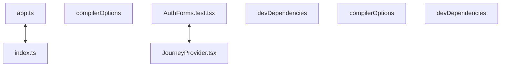

# Codebase Architectural Report

> **Auto-generated** by graphify knowledge graph analysis  
> **Purpose**: Dependency map, connection analysis, subsystem breakdown, and quality hotspots.

---

## 1. Executive Summary

- **Total Components**: `208`
- **Total Connections**: `266`
- **Subsystem Modules**: `1`
- **Dependency Types**: `9`

**Key Architectural Hubs:**

| # | Component | File | Type | Connections |
|---|-----------|------|------|-------------|
| 1 | `app.ts` | `backend/src/app.ts` | file | 16 |
| 2 | `compilerOptions` | `frontend/tsconfig.json` | function | 15 |
| 3 | `AuthForms.test.tsx` | `frontend/src/auth/AuthForms.test.tsx` | class | 13 |
| 4 | `devDependencies` | `backend/package.json` | function | 11 |
| 5 | `index.ts` | `backend/src/index.ts` | file | 11 |
| 6 | `compilerOptions` | `backend/tsconfig.json` | function | 11 |
| 7 | `devDependencies` | `frontend/package.json` | function | 11 |
| 8 | `JourneyProvider.tsx` | `frontend/src/journey/JourneyProvider.tsx` | class | 11 |

---

## 2. Dependency & Connection Analysis

### Relationship Types

| Relationship | Count | Share |
|-------------|-------|-------|
| `contains` | 127 | 48% |
| `imports` | 63 | 24% |
| `imports_from` | 33 | 12% |
| `calls` | 18 | 7% |
| `extends` | 13 | 5% |
| `indirect_call` | 6 | 2% |
| `method` | 4 | 2% |
| `rationale_for` | 1 | 0% |
| `references` | 1 | 0% |

### Hub Dependency Diagram

### Most Connected Pairs

| Component A | Component B | Shared Connections |
|-------------|-------------|-------------------|
| `build` | `scripts` | 2 |
| `dev` | `scripts` | 2 |
| `scripts` | `start` | 2 |
| `scripts` | `test` | 2 |
| `@types/node` | `devDependencies` | 2 |
| `devDependencies` | `typescript` | 2 |
| `devDependencies` | `vitest` | 2 |
| `@types/node` | `@types/node` | 2 |
| `typescript` | `typescript` | 2 |
| `vitest` | `vitest` | 2 |

---

## 3. Subsystem & Module Breakdown

### 3.1 frontend
**Nodes**: `208`  
**Files**: `.engine/memory/progress_summary.md`, `.engine/workers/8acf02cce179/scratch/findings.md`, `backend/package.json`, `backend/src/app.ts`, `backend/src/auth/auth.controller.ts`, `backend/src/auth/auth.routes.ts` +30 more

| Component | Type | File | Connections |
|-----------|------|------|-------------|
| `app.ts` | file | `backend/src/app.ts` | 16 |
| `compilerOptions` | function | `frontend/tsconfig.json` | 15 |
| `AuthForms.test.tsx` | class | `frontend/src/auth/AuthForms.test.tsx` | 13 |
| `devDependencies` | function | `backend/package.json` | 11 |
| `index.ts` | file | `backend/src/index.ts` | 11 |
| `compilerOptions` | function | `backend/tsconfig.json` | 11 |
| `devDependencies` | function | `frontend/package.json` | 11 |
| `JourneyProvider.tsx` | class | `frontend/src/journey/JourneyProvider.tsx` | 11 |
| `migrate.ts` | file | `backend/src/db/migrate.ts` | 9 |
| `createApp()` | method | `backend/src/app.ts` | 8 |

**External dependencies:** `NOTE: This file should not be edited` (1)

---

## 4. API Reference

Public classes and functions by subsystem.

### frontend

| Name | Type | File | Connections |
|------|------|------|-------------|
| `compilerOptions` | function | `frontend/tsconfig.json` | 15 |
| `AuthForms.test.tsx` | class | `frontend/src/auth/AuthForms.test.tsx` | 13 |
| `devDependencies` | function | `backend/package.json` | 11 |
| `compilerOptions` | function | `backend/tsconfig.json` | 11 |
| `devDependencies` | function | `frontend/package.json` | 11 |
| `JourneyProvider.tsx` | class | `frontend/src/journey/JourneyProvider.tsx` | 11 |
| `AuthService` | class | `backend/src/auth/auth.service.ts` | 8 |
| `dependencies` | function | `backend/package.json` | 7 |

---

## 5. Code Quality & Architectural Risk Hotspots

### Component Type Distribution

| Type | Count | Share |
|------|-------|-------|
| function | 137 | 66% |
| method | 25 | 12% |
| file | 23 | 11% |
| class | 23 | 11% |

### High-Connectivity Hotspots

**1** component(s) with >15 connections:

| Component | File | Connections |
|-----------|------|-------------|
| `app.ts` | `backend/src/app.ts` | 16 |

### Dependency Cycles

**73** circular dependency loop(s) detected:

| # | Cycle Path |
|---|-----------|
| 1 | `frontend_src_auth_loginform → frontend_src_journey_journeyprovider → frontend_src_journey_journeyprovider_usejourney` |
| 2 | `frontend_src_auth_otpform → frontend_src_journey_journeyprovider → frontend_src_journey_journeyprovider_usejourney` |
| 3 | `frontend_src_journey_journeyprovider_journeyprovider → frontend_src_journey_journeyprovider_journeyreducer → frontend_src_journey_journeyprovider` |
| 4 | `frontend_app_layout → frontend_src_journey_journeyprovider_journeyprovider → frontend_src_journey_journeyprovider` |
| 5 | `frontend_src_auth_authforms_test → frontend_src_journey_journeyprovider_journeyprovider → frontend_src_journey_journeyprovider` |
| 6 | `frontend_src_auth_loginform → frontend_src_auth_authforms_test → frontend_src_journey_journeyprovider` |
| 7 | `frontend_src_auth_loginform_loginform → frontend_src_auth_authforms_test → frontend_src_journey_journeyprovider → frontend_src_journey_journeyprovider_usejourney` |
| 8 | `frontend_src_auth_otpform → frontend_src_auth_authforms_test → frontend_src_journey_journeyprovider` |
| 9 | `frontend_src_auth_otpform_otpform → frontend_src_auth_authforms_test → frontend_src_journey_journeyprovider → frontend_src_journey_journeyprovider_usejourney` |
| 10 | `frontend_src_api_client → frontend_src_api_client_verify → frontend_src_auth_authforms_test` |

### Orphaned Components

**8** isolated node(s) with no connections:

| Component | File |
|-----------|------|
| `backend/vitest.config.ts` | `backend/vitest.config.ts` |
| `auth.spec.ts` | `frontend/e2e/auth.spec.ts` |
| `playwright.config.ts` | `frontend/playwright.config.ts` |
| `test.setup.ts` | `frontend/test.setup.ts` |
| `frontend/vitest.config.ts` | `frontend/vitest.config.ts` |
| `discovery-selection Todo` | `todos.yaml` |
| `payment-confirmation Todo` | `todos.yaml` |
| `Authentication Access Implementation` | `.engine/workers/8acf02cce179/scratch/findings.md` |

---

## 6. How to Navigate

1. **Interactive D3 Map** — open `graph.html` to explore node connections visually.
2. **Knowledge Graph Queries** — use MCP tools (`graph_query`, `graph_explain_node`, `graph_impact_radius`).
